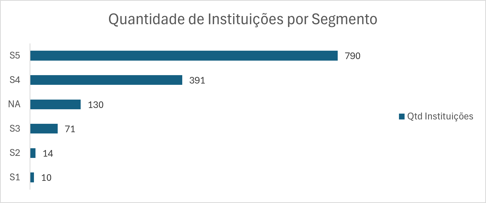
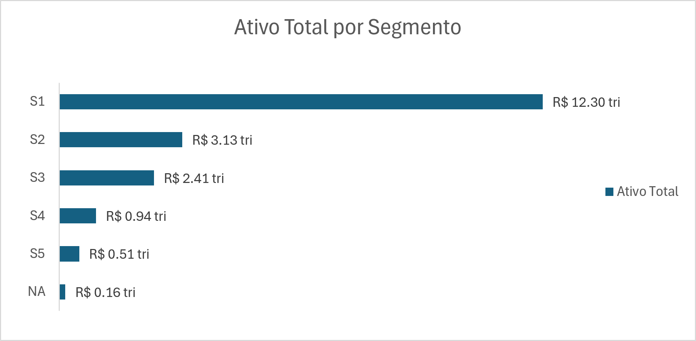
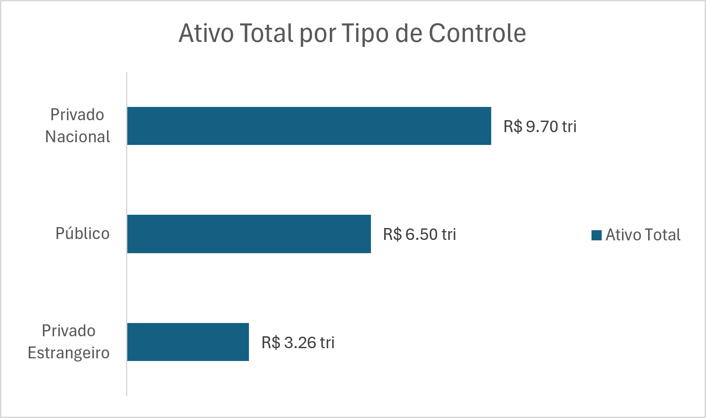
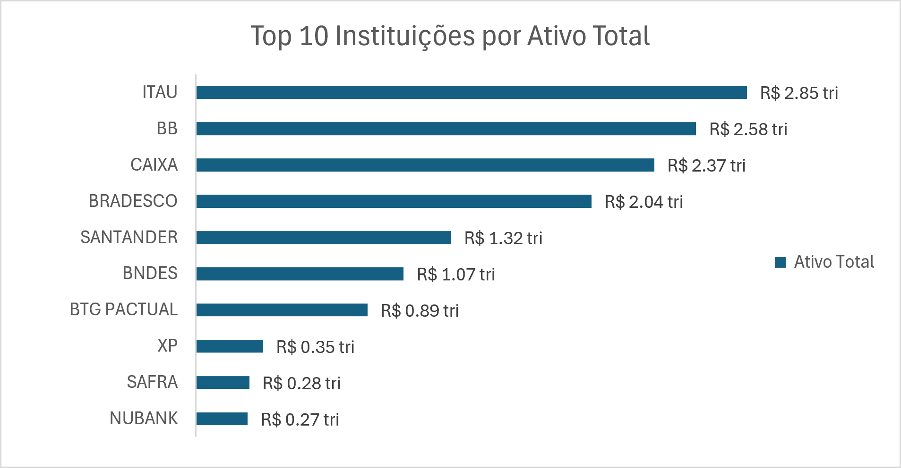
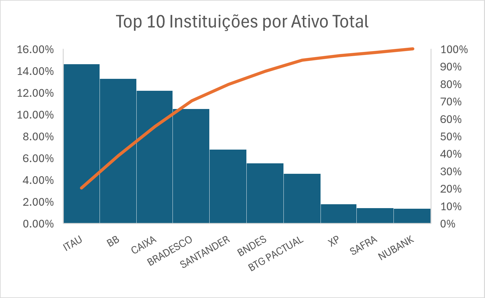
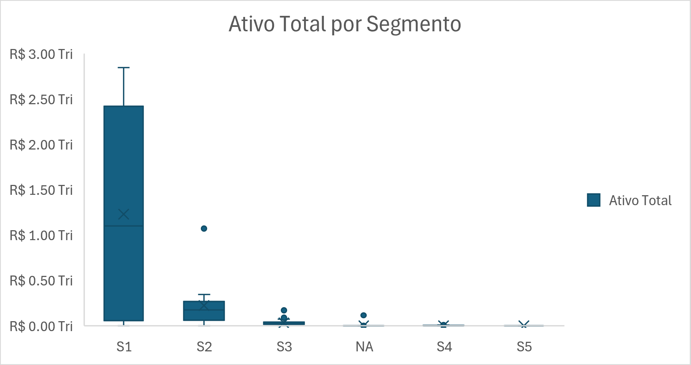
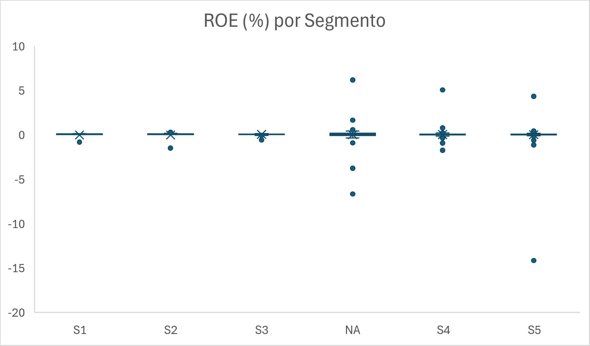

# Análise da Estrutura do Sistema Financeiro Brasileiro (IF.data - Junho/2026)

## Visão Geral

Este projeto tem como objetivo analisar a estrutura do Sistema Financeiro Nacional utilizando dados públicos disponibilizados pelo Banco Central do Brasil por meio da plataforma IF.data.

A análise explora a distribuição dos ativos, carteira de crédito, rentabilidade e características operacionais das instituições financeiras brasileiras, identificando padrões de concentração, participação por tipo de controle e indícios de transformação digital no setor.

---

## Objetivos da Análise

Responder às seguintes perguntas de negócio:

- Como os ativos estão distribuídos entre as instituições financeiras brasileiras?
- Existe concentração relevante de mercado?
- Qual a participação das instituições públicas no sistema financeiro?
- Como está distribuída a rentabilidade (ROE) das instituições?
- Há evidências de transformação digital no setor?

---

## Base de Dados

**Fonte:** IF.data – Banco Central do Brasil

**Período:** Junho/2026

**Escopo:** 1.406 instituições financeiras, conglomerados e instituições independentes.

### Variáveis Utilizadas

- Instituição
- Segmento Prudencial (S1 a S5)
- Tipo de Controle
- Ativo Total
- Carteira de Crédito
- Patrimônio Líquido
- Lucro Líquido
- ROE (%)
- Agências
- Postos de Atendimento

---

# Principais Indicadores

| Indicador | Resultado |
|-----------|------------|
| Quantidade de Instituições | 1.406 |
| Ativo Total Agregado | R$ 19,46 trilhões |
| Participação Pública no Ativo Total | 33,39% |
| Média do Ativo Total | R$ 13,84 bilhões |
| Mediana do Ativo Total | R$ 285,69 milhões |
| Mediana da Carteira de Crédito | R$ 50,08 milhões |
| Instituições sem Agências Físicas | 739 |
| ROE Médio | 2,25% |
| ROE Mediano | 4,42% |

---

# Visualizações e Análises

## 1. Quantidade de Instituições por Segmento

### Análise

A maior parte das instituições financeiras pertence aos segmentos S4 e S5, com destaque para o segmento S5, que concentra aproximadamente 76% da amostra analisada.

Embora representem a maioria das instituições, esses segmentos não necessariamente concentram a maior parcela dos recursos financeiros do sistema, demonstrando uma estrutura heterogênea em termos de porte.

---

## 2. Ativo Total por Segmento

### Análise

O segmento S1 concentra aproximadamente R$ 12,3 trilhões em ativos, correspondendo a cerca de 63% do ativo total analisado.

Apesar de contar com apenas 10 instituições, o segmento S1 apresenta volume de ativos superior à soma de vários segmentos menores, evidenciando elevada concentração financeira no sistema.

---

## 3. Ativo Total por Tipo de Controle

### Análise

As instituições privadas nacionais concentram a maior parcela dos ativos da amostra, seguidas pelas instituições públicas.

Os dados mostram que aproximadamente um terço dos ativos está sob controle público, indicando que o Estado continua desempenhando papel relevante na intermediação financeira brasileira.

---

## 4. Top 10 Instituições por Ativo Total

### Análise

Itaú, Banco do Brasil, Caixa Econômica Federal, Bradesco e Santander lideram o ranking das instituições com maior volume de ativos.

O gráfico mostra a predominância de um pequeno grupo de instituições de grande porte em relação às demais organizações presentes na base.

---

## 5. Curva de Pareto dos Maiores Bancos

### Análise

A curva acumulada evidencia que um grupo reduzido de instituições concentra parcela expressiva dos ativos observados.

O comportamento da curva reforça a hipótese de elevada concentração estrutural do sistema financeiro nacional, onde poucos participantes detêm grande parte dos recursos disponíveis.

---

## 6. Distribuição do Ativo Total por Segmento (Boxplot)

### Análise

O boxplot evidencia forte assimetria entre os segmentos analisados.

Observa-se ampla dispersão dos valores, especialmente no segmento S1, além da presença de instituições significativamente maiores que suas pares, característica típica de mercados concentrados.

O gráfico também ajuda a explicar a grande diferença entre o ativo médio e o ativo mediano observados na análise.

---

## 7. Distribuição do ROE por Segmento (Boxplot)

### Análise

Os resultados mostram elevada variabilidade de rentabilidade entre as instituições.

Também são observados outliers positivos e negativos, indicando que algumas organizações apresentam desempenho significativamente diferente da maioria da amostra. Adicionalmente, a presença desses outliers reduz a visibilidade dos quartis, mas constitui uma característica relevante da amostra.

A diferença entre ROE médio (2,25%) e ROE mediano (4,42%) sugere que instituições com desempenho muito negativo influenciam o resultado agregado.

---

# Principal Insight

> Embora o sistema financeiro brasileiro seja composto por mais de mil instituições, a maior parte dos ativos permanece concentrada em um grupo reduzido de organizações de grande porte.

## Evidências

- Apenas 10 instituições pertencem ao segmento S1.
- O segmento S1 concentra aproximadamente R$ 12,3 trilhões em ativos, cerca de 63% do total analisado.
- O ativo médio é aproximadamente 48 vezes superior ao ativo mediano.
- Mais de 70% das instituições da base não possuem agências físicas.

---

# Implicações

## Para o Setor Financeiro

Os resultados indicam uma estrutura de mercado altamente concentrada, na qual poucas instituições exercem influência significativa sobre a oferta de crédito e a intermediação financeira.

Ao mesmo tempo, a elevada quantidade de instituições sem agências físicas sugere avanço dos modelos digitais e redução da dependência de estruturas presenciais.

## Para um Analista de Dados

A análise demonstra a importância de combinar medidas de tendência central, dispersão e concentração para evitar conclusões baseadas exclusivamente em médias agregadas.

O estudo também evidencia a relevância da análise exploratória na identificação de assimetrias, outliers e padrões estruturais dos dados.

---

# Limitações da Análise

- Análise baseada em apenas um recorte temporal (junho/2026).
- Não foi considerada a evolução histórica dos indicadores.
- Algumas instituições podem pertencer ao mesmo conglomerado econômico e aparecer separadamente na base.
- Não foram avaliados indicadores de inadimplência, liquidez ou eficiência operacional.

---

# Próximos Passos

Possíveis extensões desta análise incluem:

- Avaliação da evolução histórica dos ativos e da carteira de crédito.
- Estudo da evolução da concentração bancária ao longo do tempo.
- Análise da relação entre porte e rentabilidade.
- Comparação dos indicadores entre tipos de controle.
- Construção de dashboards interativos em Power BI.

---

# Ferramentas Utilizadas

- Microsoft Excel
- GitHub
- IF.data (Banco Central do Brasil)

---

# Autor

**Claudio Da Cunha Machado**

Projeto desenvolvido como parte dos estudos em Business Intelligence, Data Analytics e visualização de dados utilizando informações públicas do Sistema Financeiro Nacional.
